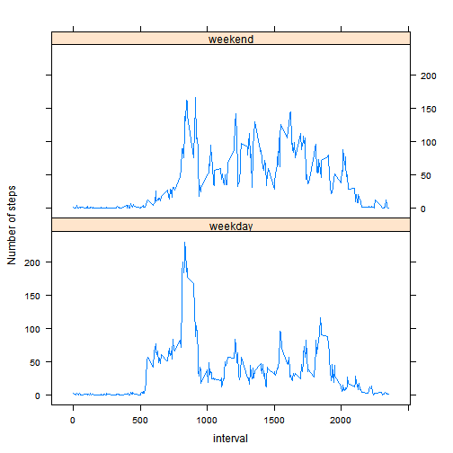

# Reproducible Research: Peer Assessment 1

```r
library(lattice)
```

```
## Warning: package 'lattice' was built under R version 3.0.3
```

## Loading and preprocessing the data

```r
temp <- tempfile()
download.file("http://d396qusza40orc.cloudfront.net/repdata%2Fdata%2Factivity.zip",temp)
activity <- read.csv(unz(temp, "activity.csv"))
activity$date <- as.Date(activity$date, "%Y-%m-%d")
```

## What is mean total number of steps taken per day?

```r
totalDay<-aggregate(steps ~ date, data = activity, sum)
hist(totalDay$steps, main="Total number of steps taken per day", xlab="Steps")
```

 

```r
meanDay<-mean(totalDay$steps)
medianDay<-median(totalDay$steps)
```

Ignoring the missing values in the dataset

* Mean total number of steps taken per day= 1.0766 &times; 10<sup>4</sup>
* Median total number of steps taken per day= 10765

## What is the average daily activity pattern?

```r
avgSteps<-aggregate(steps ~ interval, data = activity, mean)
xyplot(steps~interval, data=avgSteps,xlab="5-minute intervals", ylab="Average steps taken across all days", type="l")
```

 

```r
max<-avgSteps[(avgSteps$steps==max(avgSteps$steps)),]
maxSteps<-max$steps
maxInterval<-max$interval
```

* 835 (5-minute interval), on average across all the days in the dataset, contains the maximum number of steps 206.1698.

## Imputing missing values
Strategy for filling the missing value : 
I use the mean for that 5-minute interval if it is missing against any date and interval combination.
  

```r
        noNa<-sum(is.na(activity[,1]))

# Creating a new dataset that is equal to the original dataset but with missing data filled in. 
          activity1=activity
          for(i in seq_len(nrow(activity1))) {
              
              if (is.na(activity1$steps[i])) {
                  activity1$steps[i]=avgSteps$steps[avgSteps$interval==activity1$interval[i]]}
              }
          
          totalDay1<-aggregate(steps ~ date, data = activity1, sum)

          hist(totalDay1$steps, main="Total number of steps taken per day", xlab="Steps")
```

 

```r
            meanDay1<-mean(totalDay1$steps)
            medianDay1<-median(totalDay1$steps)
```

* Total number of missing values (coded as NA) is 2304.

Missing values in the datasets activity filled in

* Mean total number of steps taken per day= 1.0766 &times; 10<sup>4</sup>
* Median total number of steps taken per day= 1.0766 &times; 10<sup>4</sup>

## Are there differences in activity patterns between weekdays and weekends?
                    

```r
          activity1[,4]<-weekdays(activity1$date)
          for(i in seq_len(nrow(activity1))) {
              if (activity1[i,4]=="Sunday"|activity1[i,4]=="Saturday") {
                  activity1[i,4]="weekend"}
              else 
                    {
                      activity1[i,4]="weekday"
                    }
              }
          colnames(activity1)[4]<-"day"
          
          stepsday<-aggregate(steps ~ interval+day, data = activity1, mean)
          xyplot(steps~interval|day, data=stepsday, layout=c(1,2), type="l", ylab="Number of steps")
```

 
